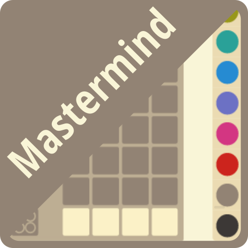
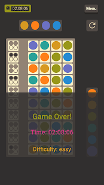
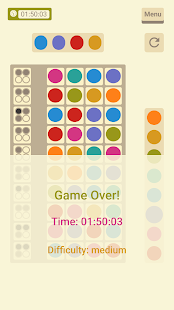

<!-- PROJECT SHIELDS -->
[![Contributors][contributors-shield]][contributors-url]
[![Forks][forks-shield]][forks-url]
[![Stargazers][stars-shield]][stars-url]
[![Issues][issues-shield]][issues-url]
[![MIT License][license-shield]][license-url]

<!-- PROJECT LOGO -->
<br />
<p align="center">
  <a href="https://github.com/usm4n/ionic-mastermind">
    
  </a>

  <h3 align="center">Mastermind Puzzle</h3>

  <p align="center">
    A Project built with Ionic and Angular Frameworks.
    <br />
    <a href="https://github.com/usm4n/ionic-mastermind"><strong>Explore the docs »</strong></a>
    <br />
    <br />
    <a href = "https: //github.com/usm4n/ionic-mastermind">View Demo</a>
    ·
    <a href="https://github.com/usm4n/ionic-mastermind/issues">Report Bug</a>
    ·
    <a href="https://github.com/usm4n/ionic-mastermind/issues">Request Feature</a>
  </p>
</p>

<!-- TABLE OF CONTENTS -->
<details open="open">
  <summary>Table of Contents</summary>
  <ol>
    <li>
      <a href="#about-the-project">About The Project</a>
      <ul>
        <li><a href="#built-with">Built With</a></li>
      </ul>
    </li>
    <li>
      <a href="#getting-started">Getting Started</a>
      <ul>
        <li><a href="#prerequisites">Prerequisites</a></li>
        <li><a href="#installation">Installation</a></li>
      </ul>
    </li>
    <li><a href="#roadmap">Roadmap</a></li>
    <li><a href="#contributing">Contributing</a></li>
    <li><a href="#license">License</a></li>
    <li><a href="#contact">Contact</a></li>
    <li><a href="#acknowledgements">Acknowledgements</a></li>
  </ol>
</details>

<!-- ABOUT THE PROJECT -->
## About The Project

|Dark Version :| Light Version: |
|---|---|
|||

This is an implementation of popular puzzle board game called [mastermind](https://en.wikipedia.org/wiki/Mastermind_(board_game)) and was released on android play store. You can find and install it from [here](https://play.google.com/store/apps/details?id=com.eggies.mastermind&hl=en&gl=US).


The idea of the game is to guess a computer generated sequence of colors by filling the row slots and following the hint displayed in the left column that can be revealed by clicking/tapping on respective cell. A dark dot will signify a correct position in the original sequence while a grey dot represents a color included in the sequence but not on correct position, missing colors will be represented by empty dot slots.

The App was built using Ionic 3 and Angular framework and demonstrates various aspects of both frameworks like: custom themes, reactive programming using RxJS, saving/loading settings from storage etc. Also, the game comes with multiple difficulty levels to choose from so you can get the hang of it in a gradual manner.


The App is open sourced to appreciate the great efforts and work of both the Ionic and Angular Dev teams.

### Built With

Following technologies are used in building this App:

* [Ionic Framework](https://ionicframework.com/)
* [Angular Framework](https://angular.io/)
* [RxJS](https://rxjs-dev.firebaseapp.com/)
* [Sass](https://sass-lang.com/)


<!-- GETTING STARTED -->
## Getting Started

If you want to run/test and improve this App follow the instructions given in this section.

### Prerequisites

Following tools will be needed to run the project on your local machine:

* npm
  ```sh
  npm install -g npm@latest
  ```
* Ionic Cli
  ```sh
  npm install -g @ionic/cli
  ```
* Cordova
  ```sh
  npm install -g cordova
  ```
* [Java 8 SDK](https://www.oracle.com/in/java/technologies/javase/javase-jdk8-downloads.html)

### Installation

1. Clone the repo
   ```sh
   git clone https://github.com/usm4n/ionic-mastermind.git
   ```
2. Install NPM packages by running following command inside the project directory.
   ```sh
   npm install
   ```
3. Serve you App in browser using:
   ```sh
   ionic serve
   ```

Further instructions on building and deploying for a specific platform can be found [here](https://ionicframework.com/docs/developing/starting).

<!-- ROADMAP -->
## Roadmap

See the [open issues](https://github.com/usm4n/ionic-mastermind/issues) for a list of proposed features (and known issues).

<!-- CONTRIBUTING -->
## Contributing

Contributions are what make the open source community such an amazing place to be learn, inspire, and create. Any contributions you make are **greatly appreciated**.

1. Fork the Project
2. Create your Feature Branch (`git checkout -b feature/AmazingFeature`)
3. Commit your Changes (`git commit -m 'Add some AmazingFeature'`)
4. Push to the Branch (`git push origin feature/AmazingFeature`)
5. Open a Pull Request

<!-- LICENSE -->
## License

Distributed under the MIT License. See `LICENSE` for more information.

<!-- CONTACT -->
## Contact

Usman Riaz - usmanri4z@gmail.com

Project Link: [https://github.com/usm4n/ionic-mastermind](https://github.com/usm4n/ionic-mastermind)

<!-- ACKNOWLEDGEMENTS -->
## Acknowledgements

* [Ionic Framework Documentation](https://ionicframework.com/docs)
* [Angular Framework Documentation](https://angular.io/docs)

<!-- MARKDOWN LINKS & IMAGES -->
<!-- https://www.markdownguide.org/basic-syntax/#reference-style-links -->
[contributors-shield]: https://img.shields.io/github/contributors/usm4n/ionic-mastermind.svg?style=for-the-badge
[contributors-url]: https://github.com/usm4n/ionic-mastermind/graphs/contributors
[forks-shield]: https://img.shields.io/github/forks/usm4n/ionic-mastermind.svg?style=for-the-badge
[forks-url]: https://github.com/usm4n/ionic-mastermind/network/members
[stars-shield]: https://img.shields.io/github/stars/usm4n/ionic-mastermind.svg?style=for-the-badge
[stars-url]: https://github.com/usm4n/ionic-mastermind/stargazers
[issues-shield]: https://img.shields.io/github/issues/usm4n/ionic-mastermind.svg?style=for-the-badge
[issues-url]: https://github.com/usm4n/ionic-mastermind/issues
[license-shield]: https://img.shields.io/github/license/usm4n/ionic-mastermind.svg?style=for-the-badge
[license-url]: https://github.com/usm4n/ionic-mastermind/blob/master/LICENSE.txt
